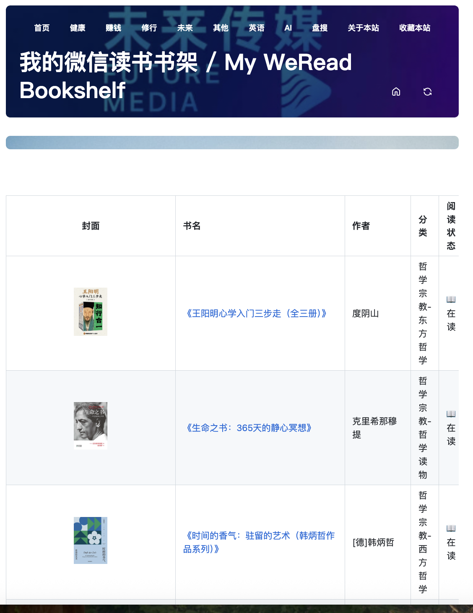

# 将微信读书状态自动同步到issues并自动渲染成网页

## 项目说明

- 从https://github.com/sailor0913/weread-to-notion获得启发并且fork源仓库自行修改修改。修改后本仓库已经不具备同步到Notion功能，请务必注意。
- 通过 github actions 每天定时同步
- 同步微信读书部分元数据信息

## 最终效果

[点我查看在线版](https://www.futuremedia.work/post/weread-shelf-sync.html)

## 截图

## 使用教程

**注意：** 项目仍在迭代中，后续如果能拿到微信读书新api的权限的方法，可以考虑为每一本书生成issue和讨论。

### 文字教程
 如果需要教程，请联系我。也请关注[未来传媒](https://www.futuremedia.work)

## 致谢

[obsidian-weread-plugin](https://github.com/zhaohongxuan/obsidian-weread-plugin)  
[weread2notion](https://github.com/malinkang/weread2notion)
